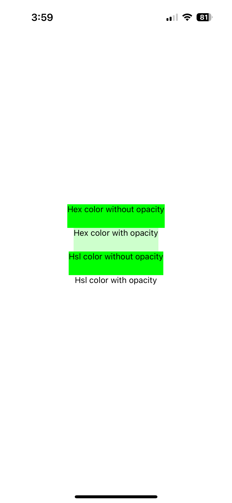

# NativeWind Bug

### How to run

`npm start`

### Bug description

When a customer color is defined using the Hsl format in `tailwind.config.js`, the color opacity syntax of Tailwind `bg-{color-name}/{opacity-value}` doesn't work.

### What you should see

